# 🧠 PCB Designs by Chamath Diunugala

This repository contains a collection of custom-designed PCBs for various electronics projects, including audio systems, power supplies, robotics, and microcontroller platforms. Each PCB is designed using industry-standard practices for educational and practical purposes.

---

## 1️⃣ Analog Volume Expander

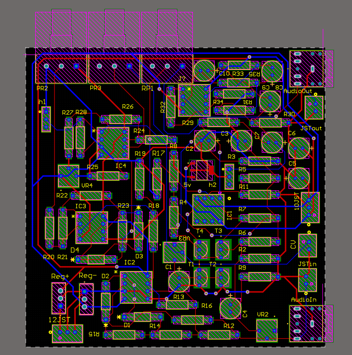  
*2D view showing the op-amp-based signal amplification layout.*

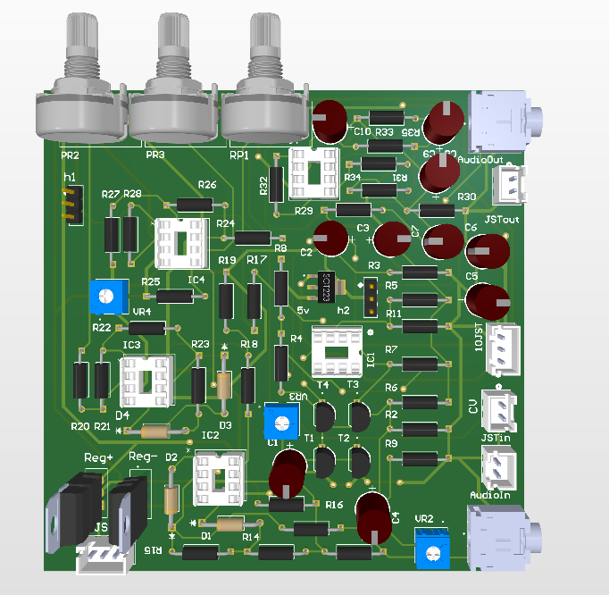  
*3D render visualizing the assembled board.*

> 📌 A compact analog circuit to dynamically boost low-level audio signals using op-amps. Useful for expanding signal range before amplification.

---

## 2️⃣ Dual Power Supply Module

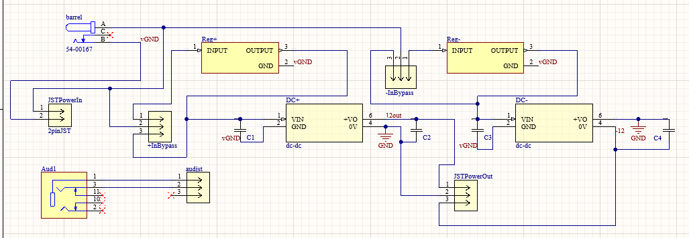  
*2D view with LM317 and LM337 regulators.*

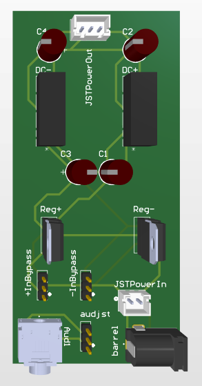  
*3D view showing heat sinks and connectors.*

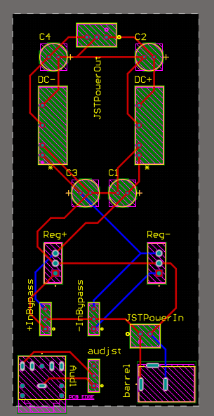  
*Circuit diagram of dual linear regulator system.*

> ⚡ Provides +12V and -12V (or similar) regulated outputs from a single DC source. Ideal for analog op-amp circuits and symmetric supplies.

---

## 3️⃣ Arduino Mega Breakout Board

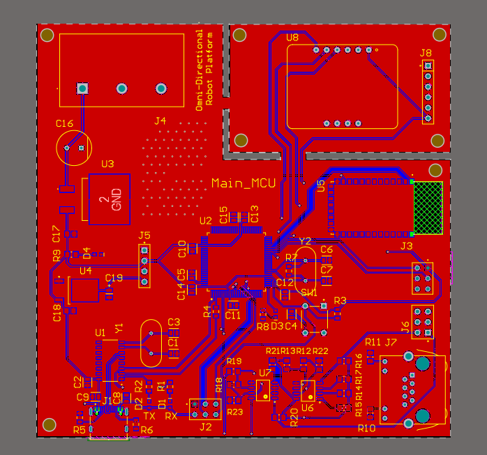  
*Top layer with all Mega pins broken out for easy prototyping.*

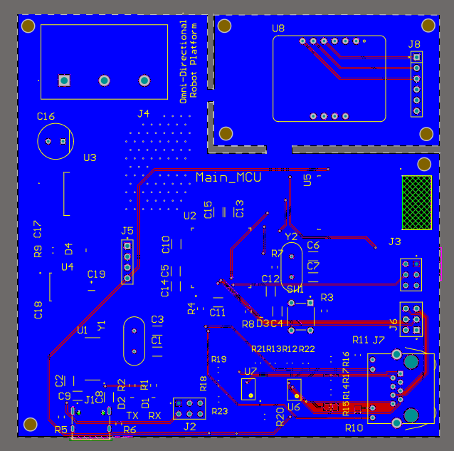  
*Clean bottom layout for simplified routing.*

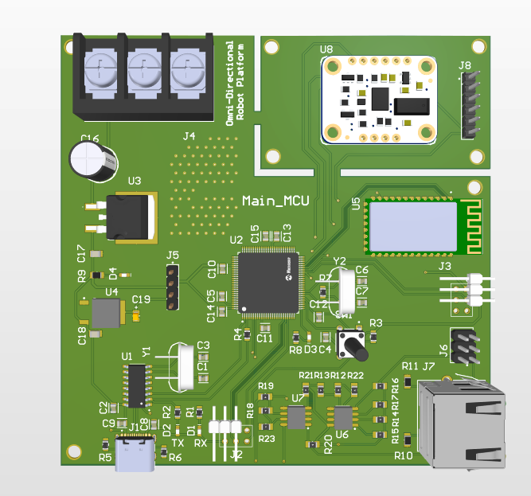  
*3D render including header pins and power jack.*

> 🤖 Breakout board that allows easy access to all Arduino Mega I/O pins, designed to work with shields or breadboards for rapid prototyping.

---

## 4️⃣ Line Follower IR Sensor Array

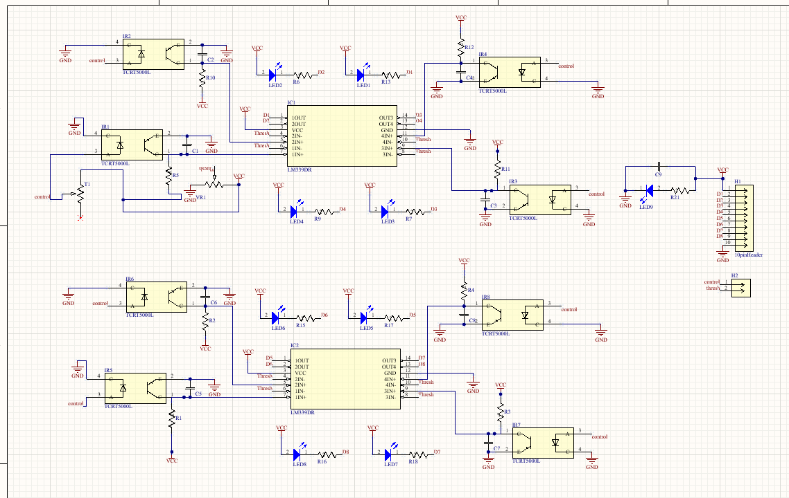  
*2D View showing 5 IR sensors aligned in a row.*

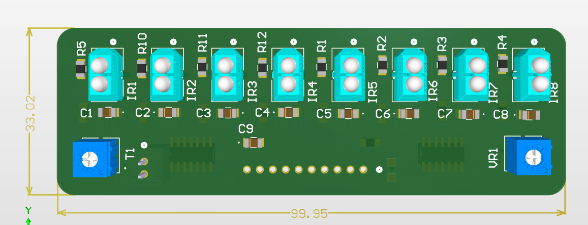  
*3D view with IR emitter/detector modules.*

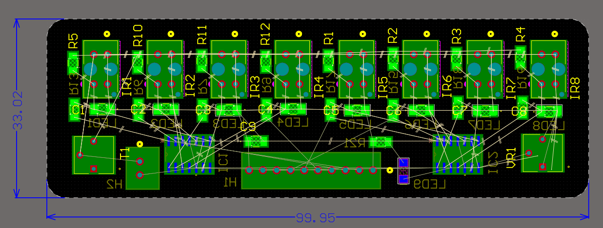  
*Sensor connections and voltage divider setup.*

> 🛣️ Infrared sensor array designed to detect black/white lines for a line follower robot. Includes analog output for smoother PID control.
